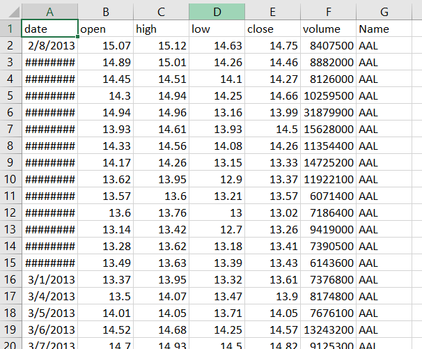
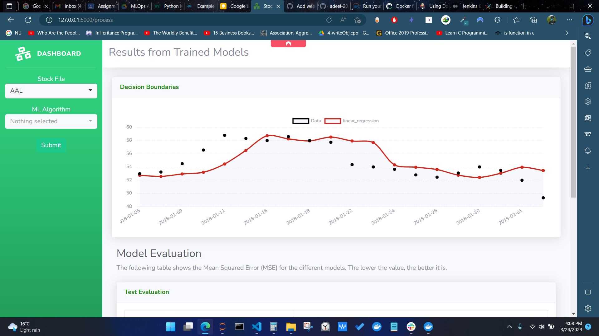
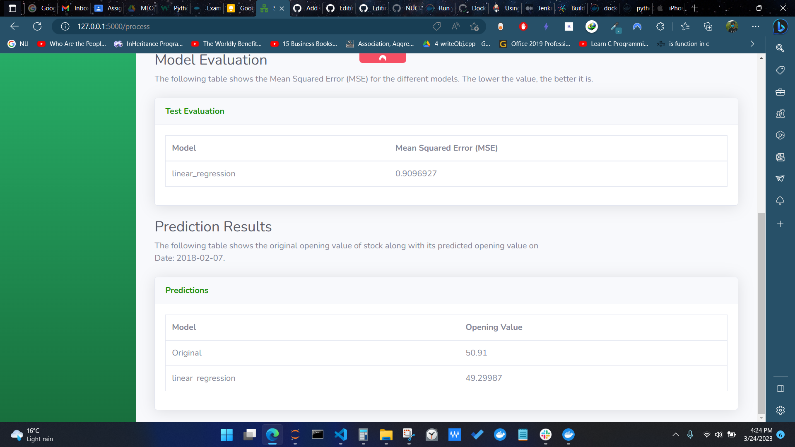
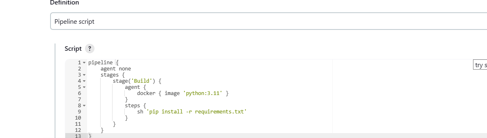
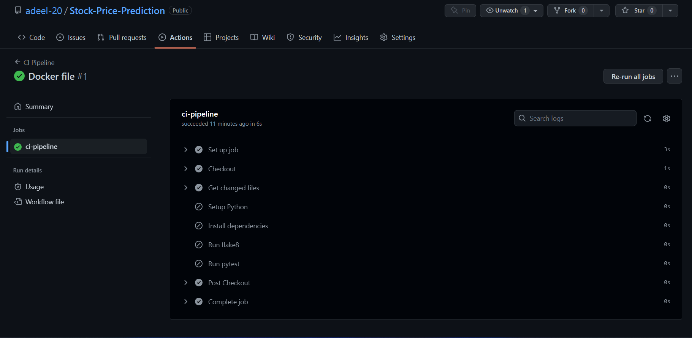

# Stock-Price-Prediction
# MLOPS Assignment#2
# 19I-1869 Adeel Subhan, 19I-1750 Fateh Muhammad

### Assignment Details
#### 1) Initially, you are supposed to select a livestream as an input to your system For example. Pakistan Stock Exchange, Twitter data etc.

We've used publically available data from API to train the stock prediction models. When running the application the inference data will be fetchd from api.

#### 2) You are required to train ML model(s) of your choice on the selected live stream.

Models trained are:
* SVR
* Linear Regression
* Random Forest 

#### 3) Then the trained models are wrapped in a Flask application. Flask application must work in two modes,
##### a. Live dashboard showing live data along with the prediction of your model(s). Different metrics of the model must also be shown on the dashboard.
The Image shows live data prediction with appropriate metrics

##### b. In the second mode Flask app will act as a service where a user can provide an instance of the live data to get the accuracy.
Live accuracy and model evaluation of data.

#### 4) Delivery phase will be implemented using Jenkins. Jenkins will be connected with your above mentioned Git repository and appropriate triggers it will be synced. After the synchronization, Build is initiated and a docker image is created. This image should be pushed to your (public) registry and also hosted as a web application (as mentioned in the point no 3).

##### a. Jenkins Job to create docker image.

##### b. CI Pipeline for smooth integration on pull request trigger.

